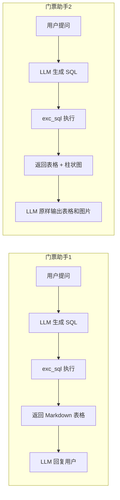

# 门票助手1.py 与 门票助手2.py 对比

对比文件：

- `门票助手1.py` — 基础版：SQL 查询 + 表格返回
- `门票助手2.py` — 增强版：SQL 查询 + 表格 + 自动柱状图可视化

两者均基于 **Qwen-Agent 框架**（`Assistant`、`BaseTool`、`WebUI`），整体架构一致，差异集中在工具能力、Prompt 约束和返回内容形态。

---

## 1. 总体对比

| 维度 | 门票助手1.py | 门票助手2.py |
| ---- | ------------ | ------------ |
| 代码行数 | 181 行 | 254 行 |
| 核心能力 | 执行 SQL，返回 Markdown 表格（前 10 行） | 执行 SQL + 自动绘制柱状图，返回表格 + 图片 |
| 额外依赖 | 无 | `matplotlib`（在 `call` 内按需导入） |
| 输出目录 | 无 | 自动创建 `image_show/` 存放图表 |
| Agent 初始化 | 相同 | 相同 |
| TUI / GUI | 相同 | 相同 |

---

## 2. 相同部分

以下内容两份文件**完全一致**：

- 导入与 DashScope 配置（`api_key`、`timeout`）
- `ROOT_RESOURCE` 资源目录定义
- 数据库表结构说明（`system_prompt` 前半段）
- `ExcSQLTool.parameters` 参数定义（`sql_input`）
- 数据库连接字符串与连接池配置
- `init_agent_service()`：`qwen-flash` 模型 + `function_list=["exc_sql"]`
- `app_tui()` / `app_gui()` 交互逻辑
- `chatbot_config` 中的 3 个示例问题
- 默认启动方式：`app_gui()`

---

## 3. 差异详解

### 3.1 System Prompt

**门票助手1**：仅包含表结构、SKU 说明和 SQL 编写指引。

**门票助手2**：在末尾追加输出约束：

```text
每当 exc_sql 工具返回 markdown 表格和图片时，你必须原样输出工具返回的全部内容
（包括图片 markdown），不要只总结表格，也不要省略图片。
这样用户才能直接看到表格和图片。
```

作用：防止 LLM 对工具返回做摘要，确保 WebUI 能展示完整表格和图表。

---

### 3.2 functions_desc（仅门票助手2 存在）

门票助手2 额外定义了 OpenAI 风格的 `functions_desc`：

```python
functions_desc = [
    {
        "name": "exc_sql",
        "description": "对于生成的SQL，进行SQL查询",
        "parameters": {
            "type": "object",
            "properties": {
                "sql_input": {"type": "string", "description": "生成的SQL语句"},
            },
            "required": ["sql_input"],
        },
    },
]
```

注意：该变量**未被 `init_agent_service()` 引用**，实际工具注册仍通过 `@register_tool("exc_sql")` + `function_list=["exc_sql"]` 完成。属于冗余定义，可能是从原生 Function Calling 写法迁移时遗留。

---

### 3.3 会话隔离相关代码（仅门票助手2 存在）

门票助手2 新增：

```python
_last_df_dict = {}

def get_session_id(kwargs):
    messages = kwargs.get("messages")
    if messages is not None:
        return id(messages)
    return None
```

注意：`_last_df_dict` 和 `get_session_id` 在后续代码中**均未使用**，属于未完成或废弃的会话隔离设计，对当前功能无实际影响。

---

### 3.4 ExcSQLTool 工具类

| 项目 | 门票助手1 | 门票助手2 |
| ---- | --------- | --------- |
| 类文档 | SQL 查询工具，执行 SQL 并返回结果 | 增加「并自动进行可视化」 |
| `description` | 对于生成的SQL，进行SQL查询 | 对于生成的SQL，进行SQL查询，**并自动可视化** |
| 返回内容 | `df.head(10).to_markdown()` | Markdown 表格 + `` |
| 异常信息 | `SQL执行出错: ...` | `SQL执行或可视化出错: ...` |

#### 门票助手1 的 call 核心逻辑

```python
df = pd.read_sql(sql_input, engine)
return df.head(10).to_markdown(index=False)
```

#### 门票助手2 新增的可视化逻辑

1. 查询得到 `df` 后，生成 Markdown 表格（同样限制前 10 行）
2. **自动推断坐标轴**：
   - X 轴：优先取第一个 `object` 类型列，否则取第一列
   - Y 轴：所有数值类型列
3. 用 `matplotlib` 绘制柱状图（支持多 Y 列分组柱）
4. 保存到 `image_show/bar_{时间戳}.png`
5. 拼接返回：`{表格}\n\n`

---

## 4. 执行流程对比



---

## 5. 使用场景建议

| 场景 | 推荐版本 |
| ---- | -------- |
| 只需查看查询数据、学习 Function Calling 基础流程 | 门票助手1 |
| 需要在对话中直观展示统计趋势、对比分析 | 门票助手2 |
| 查询结果不适合画图（如单行聚合、纯文本列） | 门票助手1 更稳妥；门票助手2 仍会尝试画图，可能效果不佳 |
| 多用户并发 Web 服务 | 两者均未做完善的会话级状态管理；门票助手2 的图表文件名用时间戳，冲突概率低，但 `_last_df_dict` 未启用 |

---

## 6. 潜在问题与改进方向

### 门票助手1

- 工具返回纯文本表格，LLM 可能对结果做二次概括，用户看不到完整数据（门票助手2 通过 Prompt 约束缓解了类似问题）。

### 门票助手2

1. **`functions_desc` 未使用**：可删除，或改为显式传入 `Assistant`（若框架支持）。
2. **`_last_df_dict` / `get_session_id` 未使用**：应接入 `call()` 做会话级 DataFrame 缓存，或直接删除死代码。
3. **可视化策略较粗糙**：对所有查询结果强制画柱状图；当 X 轴类别过多、或数据只有一行时，图表可读性差。
4. **图表路径**：使用相对路径 `image_show/xxx.png`，需确保 WebUI 能正确解析该相对路径（通常相对于项目运行目录）。

---

## 7. 小结

门票助手2 是在门票助手1 基础上的**功能增强版**，核心增量是：

1. `exc_sql` 工具增加 **matplotlib 自动柱状图**
2. `system_prompt` 增加 **原样输出表格与图片** 的约束
3. 附带未使用的 `functions_desc` 和会话隔离骨架代码

Agent 框架用法、数据库连接、交互模式等方面两者保持一致。若只需验证 SQL + Function Calling 链路，用门票助手1 即可；若希望 Demo 具备数据可视化展示能力，使用门票助手2。
