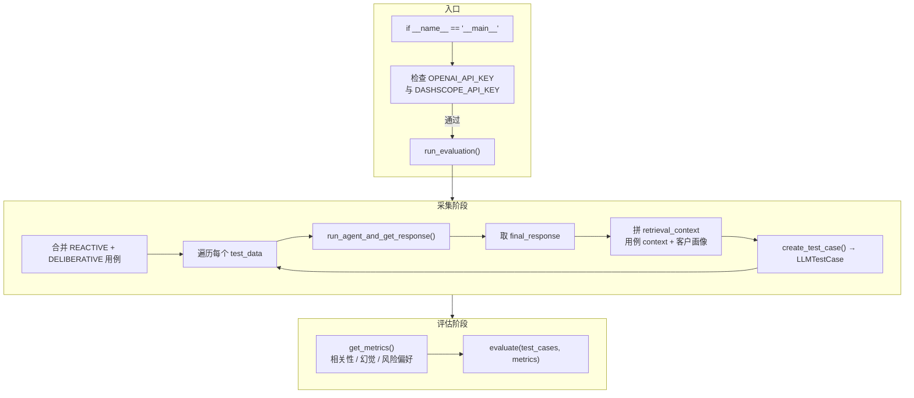
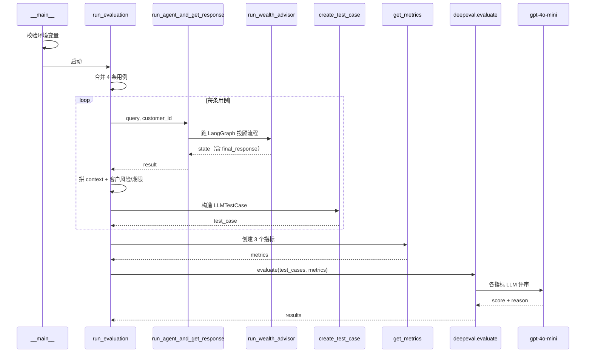
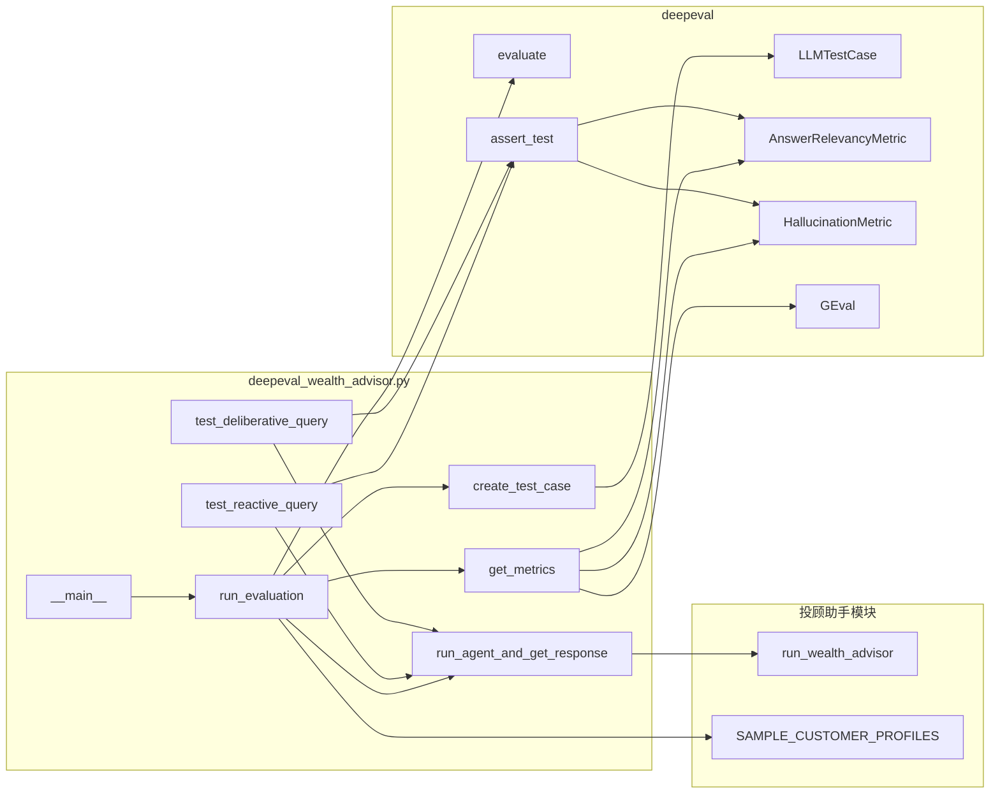
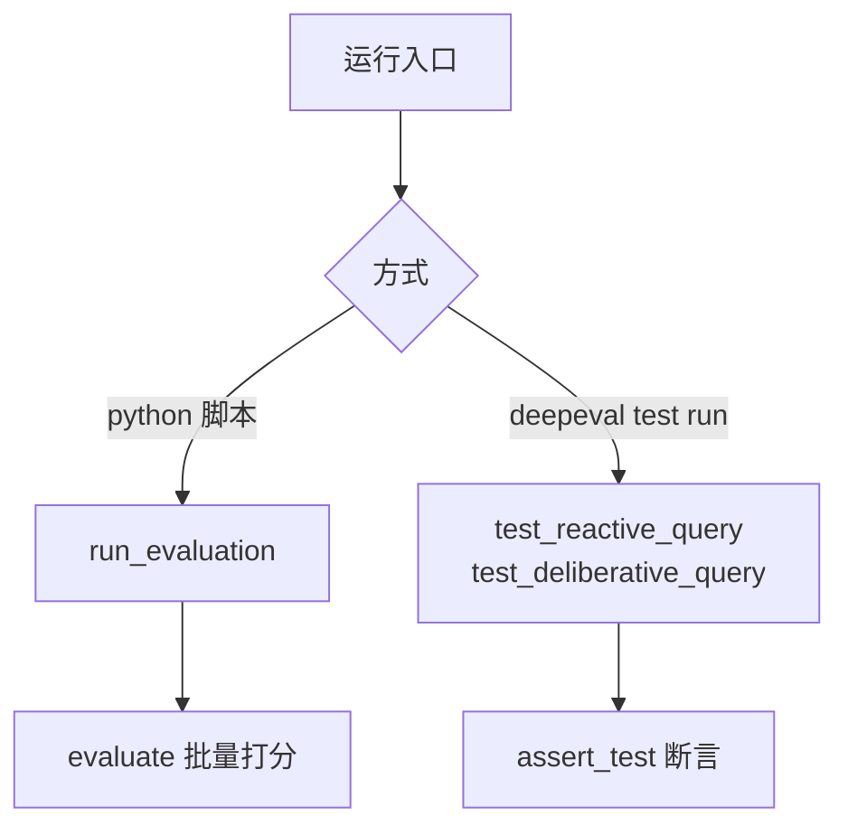
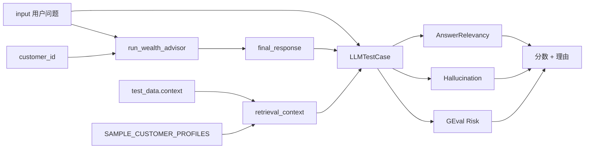

# deepeval_wealth_advisor.py 讲解

用 **DeepEval** 对投顾 AI 助手做自动化质量评估：先跑 Agent 拿到真实回答，再交给多个 LLM 评审指标打分。

---

## 1. 使用的工具与依赖

| 工具 / 库 | 作用 |
|---|---|
| **DeepEval** | 评估框架：组装 `LLMTestCase`，用 `evaluate` / `assert_test` 跑指标 |
| **AnswerRelevancyMetric** | 答案是否切题（阈值 0.6） |
| **HallucinationMetric** | 是否相对给定上下文产生幻觉（阈值 0.5） |
| **GEval** | 自定义准则：是否考虑客户风险偏好（阈值 0.5） |
| **OpenAI（gpt-4o-mini）** | DeepEval 指标背后的评审模型，需 `OPENAI_API_KEY` |
| **投顾助手模块** | 被测系统；经 `importlib` 加载后调用 `run_wealth_advisor` |
| **通义千问** | 投顾助手内部 LLM，需 `DASHSCOPE_API_KEY` |

依赖文件（脚本期望同目录存在）：

```
1-hybrid_wealth_advisor_langgraph_langsmith.py
```

其中导出 `run_wealth_advisor`、`SAMPLE_CUSTOMER_PROFILES`。本目录若只有 `1-助手+LangSmith.py`，需自行对齐文件名或调整加载路径。

---

## 2. 整体实现逻辑

脚本分两阶段：

1. **采集阶段**：遍历预置用例 → 调用投顾助手 → 收集 `final_response` → 拼出 `LLMTestCase`
2. **评估阶段**：用 3 个指标对全部用例批量打分并打印结果

另外提供两个 **Pytest / `deepeval test run` 风格** 单测函数，走 `assert_test` 断言路径。



---

## 3. 调用顺序（主流程）

按执行时间线：



对应代码路径：

1. `__main__` 检查密钥 → `run_evaluation()`
2. `all_test_data = REACTIVE_TEST_CASES + DELIBERATIVE_TEST_CASES`（共 4 条）
3. 对每条：`run_agent_and_get_response` → `run_wealth_advisor`
4. 空响应则跳过；否则组装 `retrieval_context`，`create_test_case`
5. `get_metrics()` 建 3 个指标
6. `evaluate(...)` 批量打分，`print_results=True`

---

## 4. 模块调用关系



动态加载细节（文件名以数字开头，不能普通 `import`）：

```python
spec = importlib.util.spec_from_file_location(
    "hybrid_wealth_advisor_langgraph_langsmith",
    "1-hybrid_wealth_advisor_langgraph_langsmith.py"
)
# ... exec_module 后 from ... import run_wealth_advisor, SAMPLE_CUSTOMER_PROFILES
```

---

## 5. 测试用例与指标

### 5.1 用例分组

| 分组 | 条数 | 意图 | 示例问题 |
|---|---|---|---|
| `REACTIVE_TEST_CASES` | 2 | 反应式：行情 / 概念解释 | 上证指数、ETF |
| `DELIBERATIVE_TEST_CASES` | 2 | 深思熟虑：组合调整 / 退休规划 | 风险偏好配置、退休计划 |

每条用例字段：

- `input`：用户问题
- `customer_id`：映射 `SAMPLE_CUSTOMER_PROFILES`
- `context`：幻觉检测等用的检索上下文
- `expected_keywords`：当前脚本**未参与评分**（仅数据预留）

### 5.2 三个指标

| 指标 | 阈值 | 评审模型 | 看什么 |
|---|---|---|---|
| `AnswerRelevancyMetric` | 0.6 | gpt-4o-mini | 回答是否相关于 `input` |
| `HallucinationMetric` | 0.5 | gpt-4o-mini | `actual_output` 相对 `retrieval_context` 是否编造 |
| `GEval(RiskConsideration)` | 0.5 | gpt-4o-mini | 是否考虑风险承受力与偏好（看 INPUT + ACTUAL_OUTPUT） |

`retrieval_context` 拼装逻辑：

```
用例自带 context
+ 客户风险等级
+ 投资期限
```

---

## 6. 两种运行方式

### 方式 A：脚本主入口（批量评估）

```powershell
$env:OPENAI_API_KEY="sk-..."
$env:DASHSCOPE_API_KEY="sk-..."
python deepeval_wealth_advisor.py
```

走 `run_evaluation()` → `evaluate()`。

### 方式 B：DeepEval / Pytest 单测

```powershell
deepeval test run deepeval_wealth_advisor.py
```

会发现并执行：

- `test_reactive_query`：仅 `AnswerRelevancyMetric`
- `test_deliberative_query`：相关性 + 幻觉

二者都用 `assert_test`，失败即断言失败。



---

## 7. 关键数据流（单条用例）



---

## 8. 小结

- **被测对象**：LangGraph 混合投顾助手（`run_wealth_advisor`）
- **评估框架**：DeepEval；评审模型默认 OpenAI `gpt-4o-mini`
- **主路径**：采回答 → 建 `LLMTestCase` → 三指标批量 `evaluate`
- **旁路**：两个 `assert_test` 单测，便于 CI / `deepeval test run`
- **环境**：同时需要 `OPENAI_API_KEY`（评审）与 `DASHSCOPE_API_KEY`（被测 Agent）
